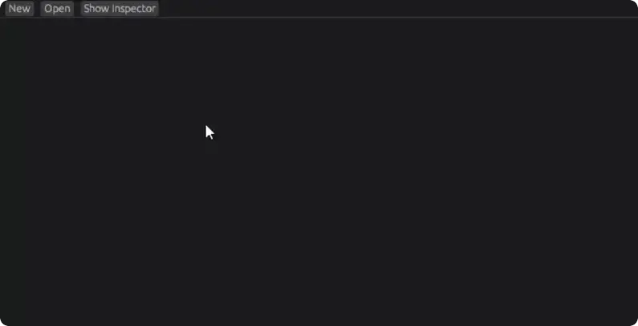

<p align="center">
  <picture>
    <source media="(prefers-color-scheme: dark)" srcset="./assets/logo_light.png">
    <source media="(prefers-color-scheme: light)" srcset="./assets/logo_dark.png">
    
  </picture>
</p>

**Gearbox** is a state machine/chart library for the [Bevy](https://bevyengine.org/) game engine.

[](#license)
[](https://crates.io/crates/bevy_gearbox)
[](https://docs.rs/bevy_gearbox)

---

## Why gearbox

State machines are useful everywhere in games - AI behavior, ability lifecycles, UI flows, animation controllers. But state machines in an ECS are a hard problem. Gearbox solves this by representing state machines as regular entity hierarchies. States are entities. Transitions are entities. Everything lives in the ECS and plays by its rules.

- **Pure ECS.** States and transitions are entities with components. Query for active states with `With<MyComponent>`. No new paradigms.
- **Fully parallelizable.** All transition resolution runs through a parallelized schedule. Thousands of machines per frame.
- **Message-driven.** Trigger transitions by writing Bevy messages. Attach side effects that automatically produce downstream messages when transitions fire.
- **Data-driven.** State machines are entity hierarchies. Spawn them from scenes, build them from assets, edit them at runtime.
- **Visual Editor** (optional). Build, edit, and monitor state machines while your game runs.

<p align="center">
  
</p>

## Getting started

```rust
use bevy::prelude::*;
use bevy_gearbox::GearboxPlugin;

fn main() {
    App::new()
        .add_plugins((DefaultPlugins, GearboxPlugin))
        .run();
}
```

## Building a state machine

```rust
// States are entities
let ready = commands.spawn_substate(machine, Name::new("Ready")).id();
let active = commands.spawn_substate(machine, Name::new("Active")).id();

// Transitions are entities
commands.spawn((Source(active), Target(ready), AlwaysEdge));

// ...with helpers to save boilerplate
commands.spawn_transition::<Activate>(ready, active);

// Initialize the machine
commands.entity(machine).init_state_machine(ready);
```

### Triggering transitions

```rust
// Define a message
#[derive(Message, Clone)]
struct Activate { machine: Entity }

impl GearboxMessage for Activate {
    type Validator = AcceptAll;
    fn machine(&self) -> Entity { self.machine }
}

// Write it from any system
fn input_system(mut writer: MessageWriter<Activate>) {
    writer.write(Activate { machine: my_entity });
}
```

### State components

Automatically insert/remove components on the machine root based on which state is active:

```rust
commands.spawn((
    SubstateOf(machine),
    StateComponent(Walking),
));
// Walking component appears on the machine entity when this state is active
```

### Reacting to state changes

```rust
fn on_enter(q_entered: Query<(Entity, &Active), Added<Active>>) {
    for (state, active) in &q_entered {
        // `state` was just entered, `active.machine` is the state machine root
    }
}

fn on_exit(mut removed: RemovedComponents<Active>) {
    for state in removed.read() {
        // `state` was just exited
    }
}
```

## Features

- Hierarchical states (nested state machines / statecharts)
- Parallel regions
- Shallow and deep history
- Guarded transitions with string-based guard sets
- Delayed transitions (timer-based)
- Always-edges (automatic transitions when conditions are met)
- Parameter-driven guards (float/int/bool ranges with hysteresis)
- Side effects (message-in, message-out on transition)
- State components (auto insert/remove on enter/exit)
- Reset edges (clear subtree state on transition)
- Internal vs external transitions

> [!WARNING]
>
> When building state machines through commands, add the `StateMachine` component **last**.
> This initializes the machine, and if the hierarchy isn't fully built yet, initialization
> will be incomplete. This is not a problem when spawning from scenes.

## Version Table

| Bevy | Gearbox |
| ---- | ------- |
| 0.18 | 0.6     |
| 0.18 | 0.5     |
| 0.17 | 0.4     |

## Contributing

Feel free to open issues or create pull requests if you encounter any problems.

Ask us on the [Bevy Discord](https://discord.com/invite/bevy) server's [Gearbox topic](https://discord.com/channels/691052431525675048/1379511828949762048) in `#ecosystem-crates` for larger changes or other things if you feel like so!

## License

Dual-licensed under MIT ([LICENSE-MIT](/LICENSE-MIT)) or Apache 2.0 ([LICENSE-APACHE](/LICENSE-APACHE)).
